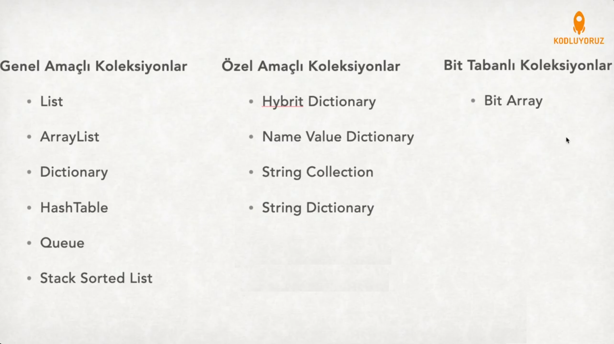

## Collections

Klasik programlama dillerinde array yani diziler çok önemli veri tipleridir. Birçok problemimizi diziler yardımıyla çözebiliriz ama bazı handikapları nedeniyle birçok sorun karşısında da yetersiz kalırlar.Bu sorunları şöyle sıralayabiliriz:

- Array'in elemanları aynı veri tipinde olmalıdır.
- Array'in boyutu önceden belirlenmelidir.

Oysa programlama dillerinde farklı türlerde verileri saklamaya ihtiyaç duyarız. Ve çoğu zaman ne kadar veri saklayacağımız program akışında belli olabilir. Koleksiyonlar tam da bu sorunları çözmek için dizilerin handikaplarından yaratılmıştır.

Dizilerin aksine koleksiyonların bazı tipleri; üzerinde çalıştıkları makinaın RAM'i yettiği sürece genişleyebilirler ve farklı türlerde veri tiplerini saklayabilirler.

Koleksiyonların elemanları object tipindedir. Hatırlayacak olursak öğrendiğimiz veri tipleri için object sınıfından türediklerini söylemiştik. Yani bu bir sorun değil, her türlü veriyi koleksiyonlar içerisinde saklayabiliriz.

Koleksiyonlar System.Collections namespace i yani isim uzayı altında bulunurlar. Yani bir koleksiyon tipini kullanmak istiyorsanız System.Collections'ı using direktifi ile programınıza import ediyor olmanız gerekiyor.

Peki bu Koleksiyonlar'ın hiç dezavantajı yok mu? Olmaz olur mu tabi ki var. Gelin yakından bakalım.

### Dezavantajları

.NEt platformda kullanıdığımız veri tipleri 2'ye ayrılır. Değer ve referans veri tipleridir. Değer tipleri belliğin stack bölgesinde tutulurken, Referans tipleri belleğin heap bölgesinde tutulur.

Değer Tipleri: int, long, float, double, decimal, char, bool, byte, short, struct, enum

Referans Tipleri: string, object, class, interface, array, delegate, pointer

Bir değer tipinin referans tipine dönüştürülme boxing, tam tersine unboxing işlemi denir.

Koleksiyonlar verilerini object tipinde tutuyor demiştik. Object de bir referans tipi. Bu demek oluyor ki değer tipinde bir veriyi koleksiyona eklemek istediğimde bir boxing işlemi yapıyorum. Daha sonra elemanı okumak istediğimde de unboxing işlemi yapıyorum. Boxing ve unboxing işlemleri bilgisayar açısından maliyetli bir işlemdir. Koleksiyon içerisindeki eleman sayısının artışına bağlı olarak bu boxing ve unboxing işlemlerinin sayısı artacaktır. Buna bağlı olarakta uygulamanın performansı olumsuz yönde etkilenecektir.

**NOT:** Boxing ve unboxing işlemlerinin performansa etkisine detaylı bakmak için şu makaleyi okumanızı öneririm:
[Burak Selim Şenyurt | Boxing ve Unboxing Performans Kritiği](https://www.buraksenyurt.com/post/Boxing-ve-Unboxing-Performans-Kritigi-bsenyurt-com-dan)

**NOT:** Heap ve stack ile detaylı bilgi için lütfen aşağıdaki makalelere göz atınız.
[Stack ve Hesap Havramları | Gökhan Gokalp](https://www.gokhan-gokalp.com/stack-heap-kavramlari/)
[Stack ve Hesap Arasındaki Fark Nedir?](https://medium.com/yigit-xcodeproj/stack-ve-heap-arasindaki-fark-nedir-stack-vs-heap-c61e3d463dd7)


## Generic List

Generic list System.Colections.Generic isim uzayı altında bulunan bir list sınıfı koleksiyonudur. Generic List bir list sınıfı tanımlarken T olarak tip değişkenini alır. Generic olmasını sağlayan da burdaki T veri tipidir. T listenin hangi türden veri tutacağını belirler. Bu tanımlama sonunda farklı türden bir veri tipini generic list ile saklayamazsınız.

[Örnek Kodlar](genericList.cs)

## Array List

Standart dizilerde aynı tipte verileri verileri bir arada tutabileceğimizi ve dizinin boyutunun belirtilmesi gerektiğinden bahsetmiştik. Arraylist tam olarak bu noktada farklılaşıyor. Farklı veri tiplerini array list içerisinde saklayabilirsiniz. Ve eleman ekleyerek ve cıkararak boyutunu dinamik olarak değiştirebilirsiniz.

Varsayılan boyutu başlangıç olarak 4'tür. Aşıldığından otomatik olarak 2 katına çıkarılır. Yani bir array liste 5. elemanı eklemeye calıştıgınızda atka planda boyutunun 8'e çıkarır.

Değişken veri tipi kullanımı kulağa ilk etapta çok konforlu gelse de risk barındır. Listeden okudugunuz verinin tipinin ne olduğunu bilmemek güvenli bir yaklaşım değildir. Tip dönüşümleri sırasında hata ihtimalini arttırır.

[Örnek Kodlar](arrayList.cs)

## Dictionary

Dictionary koleksiyonunda key-value yani anahtar-deger denen 2 kavram ile karşılaşıyoruz. Dizilere eklediğimiz elemanları value, index lerini ise key olarak düşünebilirsiniz.

Dictionary lerin elemanlarının anahtarları birbirinden farklı olmalıdır. Aynı anahtar kullanılarak 2 değer saklanamaz. Compile edilirken hata verm

Örnek söz dizimi şu şekildedir:
```c#
Dictionary<Key_Veri_Tipi, Value_Veri_Tipi> dictionary_adi = new Dictionary<Key_Veri_Tipi, Value_Veri_Tipi>();
```

[Örnek Kodlar](dictionary.cs)

---

# Sinif Sözdizimi, Field ve Metot Tanımlama, Erişim Belirleyiciler

## Sınıf Nedir, Neden İhtiyaç Duyarız ?

Sınıflar Nesne Yönelimli Programlamanın en öneeli öğesidir. C# %100 nesne yönelimli bir dil olduğu için tüm metot ve özellikler sınıflar içerisinde yer alır.

Metotlardan bahsederken bütün işlemleri tek bir metot içerisinde yazmak yerine, parçalarına yani alt metotlara ayırmak kod tekrarını azaltırken okunabilirliği arttırır demiştik. Üstelik bu şekilde yazdığınız programların daha kolay genişleyebildiğini görürsünüz.

Aynı şekilde program geliştirirken bütün metotları tek bir sınıf içerisinde yazmak yerine benzer görevleri olan metotları tek bir sınıf içerisinde toplamak en doğru yaklaşımdır.

Bir sınıfın temelde 2 tipte öğesi vardır; field/özellik ve metotlar. Aşağıda örnek bir sınıf tanımının söz dizimini görebilirsiniz.

```c#
class SinifAdi
{
    [Erişim Belirleyici][Veri Tipi] ÖzellikAdı;
    [Erişim Belirleyici][Geri Dönüş Değerinin Tipi] MetotAdi([Parametreler])
    {
        //Metot Gövdesi
    }
}
```

[Örnek Kodlar](sinifKavrami.cs)

## Erişim Belirleyiciler

Erişim belirleyiciler önüne geldiği öğenin projenin nerelerinden erişilebileceğini belirler. Öğeleri korur gibi düşünebilirsiniz.

1. Public : Her yerden erişilebilir.

2. Private : Sadece tanımlandığı sınıf içerisinden erişilebilir.

3. Internal : Sadece bulunduğu proje içerisinden erişilebilir

4. Protected : Sadece tanımlandığı sınıfta ya da o sınıfı miras alan sınıflardan erişilebilir.

## Constructor Kavramı

Bir sınıftan bir nesne oluşturulduğunda biz tanımlamasak bile arka planda çalışan varsayılan yapıcı metotlara kurucu yada constructor denir. Sınıf nesnesi ilk oluşturulduğunda yapılmasını istediğimiz işleri kurucu metotlar içerisinde yaparız.

Kurucu metot tanımlarken dikkat edilmesi gereken noktalar ise şu şekildedir:

- Kurucu metotların isimleri sınıf isimleri ile aynı olmak zorundadır.
- Public olarak bildirilmeleri gerekir.
- Geri dönüş değerleri yoktur.

Kurucu metotların imzasını değiştirerek overload edebiliriz yani aşırı yükleyebiliriz. Metotları anlatırken aşırı yüklemeden bahsetmiştik. (Bkz: Metotların Aşırı Yüklenmesi)

## Varsayılan Kurucu Metot

Her sınıfın biz tanımlamasakta bir tane kurucu metotu vardır. Buna varsayılan kurucu metot (default constructor) denir.

Default constructor'ın görevi sınıfın içerindeki özelliklere ilk değer ataması yapılmadığında onların default değerlerini set etmektir. Şöyle düşünebilirsiniz; sınıf içerisinde string veri tipinde bir özellik varsa ve siz ilk değer atamasını yapmazsanız varsayılan kurucu onun atamasını arka planda null olarak yapar. Aynı integer tipinde bir özelliğin ilk değer atamasını 0 olarak yapar.

[Örnek Kodlar](constructorMethod.cs)

## Encapsulation Kavramı ?

C#'ın %100 nesne yönelimli bir dil olduğundan bahsetmiştik. Encapsulation yani Kapsülleme kavramı bir özeliği başka sınıflardan saklamak ya da korumaktır.

Örneğin siz bir propery yani özellik tanımı yaptınız ve diğer sınıflar içerisinden erişilsin ama sadece okumak için erişilsin değeri dışarıdan değiştirilemesin istiyorsunuz. Bunu kapsülleme yaparak sağlayabilirsiniz. Kapsülleme işlemini ise property leri kullanarak yapabilirsiniz.

Kapsülleme sayesinden nesneler bilinçsiz olarak kullanımdan korunmuş olur. Fakat bazı durumlarda private field'lara erişmemiz ve özelliklerini değiştirmemiz gerekebilir. Bu durumda Property Kavramı devreye girer. Property bir field'ın değerini geri döndürmeye(Get) ve yeni bir değer(Set) atamaya olanak sağlar.

Örnek bir property kullanımı aşağıdaki gibidir:

```c#
class Ogrenci
{
    private string name; //field

    public string Name //property
    {
        get { return name; }
        set { name = value; }
    }
}
```

Yukarıda Ogrenci sınıfı içerisinde "name" isminde private bir field tanımı görüyorsunuz. Yani bu field'a sınıf dışında bir yerden erişilemez. Altındaysa "Name" isminde "name" field'ını geri döndüren Get metodu ve "name" field ına yeni değer atamasını yapabilen bir Set metodu barındıran bir property tanımı görüyoruz.

Burada property tanımlayarak "name" field'ını sınıf dışından yapılabilecek bilinçsiz atamalardan koruduk. Public property nin set metodu içerisinde bu field'a atanabilecek verileri kontrol edebilir ve müdahale edebiliriz.

Aşağıdaki örnekte yaş olarak negatif bir değer atamasına engel olan property tanımını görebilirsiniz.

```c#
class Person
{
    private int age=0;
    public int Age
    {
        get { return age; }
        set {
            if (value > 0)
            age = value;
        }
    }
}
```

## Static Sınıf ve Üyeler

### Static Üyeler

Bir sınıfın static olamayan üyelerine nesneler aracılığıyla erişirken static olan metotlara ve özelliklere ise nesne oluşturmadan o sınıfın ismi aracılığıyla erişiriz.

```c#
class Ogrenci
{
    public static int OgrenciSayisi = 0;
    public string Isim;
    public string Soyisim;
    public Ogrenci()
    {
        OgrenciSayisi++;
    }
}

class Program
{
    static void Main(string[] args)
    {
        //Static sınıf üyesine erişim
        Console.WriteLine("Öğrenci sayısı: {0}",Ogrenci.OgrenciSayisi);

        //Static olmayan sinif üyesine erişim
        Ogrenci ogrenci1 = new Ogrenci();
        ogrenci1.Isim = "Deniz";
        ogrenci1.Soyisim = "Arda";
        
        Ogrenci ogrenci2 = new Ogrenci();
        ogrenci2.Isim = "Ayşe";
        ogrenci2.Soyisim = "Yılmaz";

        Console.WriteLine("Öğrenci Sayısı: {0}", Ogrenci.OgrenciSayisi);
    }
}
```

Yukarıda hem static hemde static olmayan sınıf üyesine sahip bir sınıf tanımı ve program içerisinden kullanımı görüyorsunuz. Static olmayan üyeler nesne bazında yaratılırken static sınıf üyeleri uygulama çalıştığı sürece kendilerine atanan veriyi tutarlar. Yani yukarıdaki örnek için konuşursak, "Isim" ve "Soyisim" her nesne yaratıldığında başlangıç değeri olarak null alır, ataması yapıldığındaysa nesne bazında değerini tutar. Ama "Ogrenci Sayısı" field'ı program boyunca nesne yaratıldıkça öğrenci sayısının değerini 1 arttırarak bu veriyi korur.

Yukarıdaki örnekte de görebileceğiniz gibi bir özelliği static yapmak için geri dönüş tipi ya da veri tipinden önce erişim belirleyiciden sonra "static" anahtar kelimesini koymanız yeterlidir.

Normal metotlar gibi kurucu metotları da static olarak tanımlayabiliriz. Sınıfın static üyelerinin başlangıç değerlerini static kurucular aracılığıyla yapabiliriz. Parametre almazlar ve erişim belirleyicileri yoktur.

### Static Sınıflar

Metotlar ve özellikler gibi sınıflar da static anahtar kelimesi ile oluşturulabilirler. Yukarıdaki örnekte de görebileceğiniz üzere normal sınıflar içerisinde static metotlar ve üyeler kullanabiliriz. Peki o halde neden sınıfları static yapma ihtiyacımız olsun? Buna okunabilirliği arttırmak için diyebiliriz.

Bir sınıfın tüm üyeleri static ise sınıfı da static yapmak kullanımı kolaylaştıran bir yaklaşım olur.
